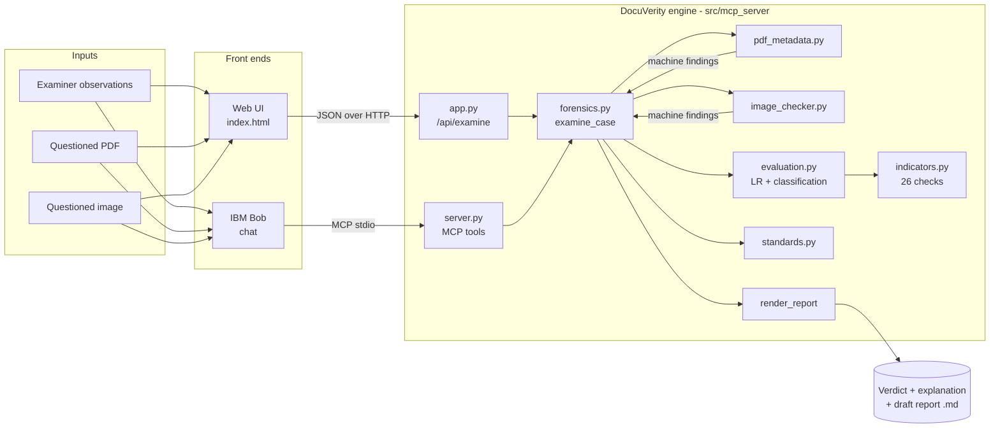
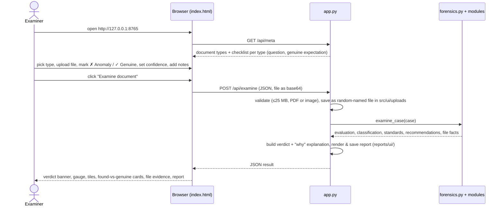
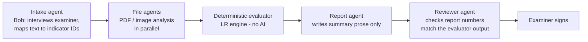

# DocuVerity — Project Analysis & End-to-End Guide

**Team Evilcorp · IBM Bob × NFSU Hackathon · Problem Statement #01 (AI-Powered Document Forgery Detection Assistant)**
Status as of 28 Sep 2026. Every number in this document was measured on the current code, not estimated.

---

## 0. At a glance

| Item | Current state |
|---|---|
| What it does | Examines a questioned document (examiner observations + PDF/image file), weighs the evidence, classifies the forgery type and drafts a court-style expert report |
| Interfaces | Web UI (`src/ui`), IBM Bob via MCP (`src/mcp_server/server.py`), Python API |
| Forgery checks | 26 indicators in 5 categories, 6 document-type checklists |
| Automated tests | 29 passing (17 scoring engine, 12 PDF metadata) |
| Speed | Full PDF examination + report: **~0.9 ms**; image analysis: **29 ms** median per image |
| PDF tamper detection | Sample genuine certificate → no anomaly (LR 0.41); tampered certificate → all 5 digital checks flagged (LR 50.5) |
| Image tamper detection | Current ELA check is **no better than chance** (49.9% on all 1,460 CG-1050 images); the noise-inconsistency idea reaches AUC 0.81 on retouched images (§9) |

---

## 1. Purpose

**The problem (from the NFSU problem statement):** fake COVID vaccination certificates (2021), 3,000+ fake degree cases (Education Ministry, 2022), forged property documents and altered FIRs reach courts regularly. Forensic document examiners record observations in free-form notes and write opinions from memory, so:
- the reasoning behind an opinion is not explicit, which weakens it under cross-examination;
- turnaround is slow in already-backlogged Forensic Science Laboratories;
- digital certificates (PDFs) are edited with free online tools, and examiners have no quick way to read the file's hidden history.

**What DocuVerity does about it:** it turns the examination into a structured, repeatable workflow:

1. **Guided checklist** — the examiner is asked the right questions for the document type (degree certificate, property deed, FIR, vaccination certificate, ID).
2. **Automatic file examination** — a PDF's revision history, software, dates and metadata consistency are read directly from the file; images get error-level analysis and EXIF checks.
3. **Evidence weighing** — every finding (including checks that came back clean) is weighed with a likelihood ratio, following the ENFSI evaluative-reporting framework used by European forensic institutes.
4. **Explanation** — for each anomaly the UI shows *what was found* next to *what a genuine document shows*, plus the high-value checks still missing.
5. **Draft report** — an 11-section court-style report, marked DRAFT, with a declaration the examiner must sign.

The examiner stays in charge: DocuVerity never signs, and the report states its own limitations.

---

## 2. Planning — how it was built

The work was split into steps, and each step was verified before the next began.

| Step | Built | Verified by | Result |
|---|---|---|---|
| 1 | Indicator catalogue, likelihood-ratio engine, classification, standards mapping | 17 unit tests with hand-calculated expected values | ✅ pass |
| 2 | PDF metadata analyzer + generator for genuine/tampered/on-demand sample certificates | 12 unit tests; independent check with `pypdf` (tampered file really shows 91.4% instead of 61.4%) | ✅ pass |
| 3 | Image checker (ELA + EXIF) | Benchmark on Kaggle CG-1050 dataset | ⚠️ works, but accuracy is weak (§9) |
| 4 | Full case pipeline + report | 3 sample cases (genuine signature, forged signature, tampered image) | ✅ pass |
| 5 | MCP server for IBM Bob | Tool listing through a real MCP client; `--demo` run | ✅ pass |
| 6 | Web UI | HTTP tests (samples, real Kaggle upload, bad upload) + headless-browser screenshots in light and dark mode | ✅ pass |

**Key design decisions**

| Decision | Why |
|---|---|
| Likelihood ratios instead of a single "AI confidence %" | It is the method forensic science uses for evaluative opinions; each finding's contribution is visible and defensible in court |
| Checks that came back clean count as evidence | "Watermark present" genuinely makes forgery less likely; ignoring it biases every report towards "forged" |
| Correlated findings in the same category are down-weighted (1, ½, ¼ …) | Shaky strokes and blunt stroke endings usually come from the same forger; counting both fully overstates the evidence |
| Bob handles language; deterministic code handles scoring | The same inputs always give the same score, so an AI model can never invent or change a number in the opinion |
| Image-check LRs set from measured benchmark results, not assumed | Prevents a weak detector from producing confident-looking verdicts |
| Standard-library web server, no framework | No installs needed on the demo machine; the network was unreliable during setup |

---

## 3. Technology stack

| Layer | Technology | Used for |
|---|---|---|
| Language | Python 3.10+ (tested on 3.13.7) | Everything server-side |
| AI assistant | **IBM Bob** | Conversational front end: interviews the examiner, maps free text to indicator IDs, calls DocuVerity tools, explains results |
| Tool protocol | MCP (Model Context Protocol) Python SDK, pinned `mcp<2.0.0` | Exposes DocuVerity functions to Bob as tools (`.bob/mcp.json` wires it up) |
| Optional LLM | watsonx.ai (Granite) via REST | Optional polishing of report language; safely skipped when no API key |
| Image processing | Pillow, NumPy | Error Level Analysis, EXIF reading |
| PDF analysis | Custom byte-level parser (no dependency) | Revisions, Info/XMP metadata, dates, producer history, SHA-256 |
| Web backend | Python `http.server` (`ThreadingHTTPServer`) | `/api/meta`, `/api/examine`, serves the page |
| Web frontend | Single-file HTML + CSS + vanilla JavaScript | Checklist, upload, results, report download; light/dark themes |
| Testing | `unittest`, `pypdf` (independent validation), headless Microsoft Edge (screenshots) | Verification at each step |
| Dataset | Kaggle CG-1050 (730 original + 730 tampered images) | Image-checker benchmark |
| Repo / CI | GitHub template + `validate.yml` action | Submission structure check |

---

## 4. Architecture & end-to-end structure

### 4.1 Folder structure

```
bob-ai-hackathon-doc-forge/
├── .bob/mcp.json                  # wires DocuVerity into IBM Bob as an MCP server
├── BOB_START_HERE.md              # kickoff instructions for Bob
├── submission.yaml / README.md    # submission metadata and front page
├── docs/                          # problem, solution, architecture, setup, this analysis
├── reports/                       # generated sample reports (reports/ui/ is git-ignored)
├── demo/                          # video link, screenshots, (ui_redesign = Bob's static mockup)
└── src/
    ├── mcp_server/                # the forensic engine
    │   ├── indicators.py          # 26 checks: question, LR, forgery mechanism, genuine expectation
    │   ├── evaluation.py          # LR combination, damping, cap, verbal scale, classification
    │   ├── standards.py           # ASTM/SWGDOC/ISO standards + BNS/BSA provisions
    │   ├── pdf_metadata.py        # byte-level PDF examination
    │   ├── image_checker.py       # ELA + EXIF
    │   ├── forensics.py           # pipeline: merge → evaluate → classify → report
    │   ├── server.py              # MCP server (3 tools) + --demo
    │   ├── watsonx_polish.py      # optional watsonx.ai call
    │   ├── samples/               # sample certificate PDFs + generator
    │   └── tests/                 # 29 unit tests
    └── ui/
        ├── app.py                 # local web server + API
        └── index.html             # the whole front end
```

### 4.2 Component diagram



### 4.3 What happens to a document, step by step

1. **Input** — examiner findings (`indicator`, `present`/`absent`, `low`/`moderate`/`high`, note) and optionally a file.
2. **File examination** — PDF → revisions, producer history, dates, Info/XMP consistency, SHA-256. Image → ELA score, EXIF software tag. Each becomes a finding in the same format as the examiner's.
3. **Merge** — examiner findings override machine findings for the same check (the human has the final word).
4. **Evaluate** — each finding gets LR<sup>confidence</sup>; findings are grouped by category and damped (1, ½, ¼ …); log-LRs are summed and capped at ±6.
5. **Classify** — support is summed per forgery mechanism (text alteration, counterfeit, simulated/traced/transplanted signature, erasure, digital manipulation); two strong mechanisms ⇒ "Composite forgery".
6. **Map standards** — standards for each category involved, plus BNS s.336/340 and BSA s.39 (s.63 when digital evidence is involved).
7. **Recommend** — high-value checks (LR ≥ 10) for this document type that were not examined.
8. **Report** — 11 sections: case table, summary, propositions, checks performed, file examination, evaluation table, classification, conclusion, recommended checks, standards, limitations, declaration.

---

## 5. How the UI works, end to end



**Request** (`POST /api/examine`):

```json
{
  "document_type": "degree_certificate",
  "stated_issue_date": "2023-06-15",
  "expected_producer": "",
  "generated_on_demand": false,
  "examiner_name": "",
  "findings": [{"indicator": "tremor_hesitation", "status": "present", "confidence": "high", "note": "slow, drawn strokes"}],
  "file": {"name": "certificate.pdf", "data": "<base64>"},
  "sample": ""
}
```

**Response** (abridged): `verdict {level, label}`, `evaluation {combined_lr, combined_log10_lr, verbal_conclusion, triage_score}`, `classification`, `explanation {why[], consistent[]}` — each `why` item has `found`, `genuine`, `lr`, `points_to` — plus `still_to_check[]`, `standards`, `file_facts`, `report_markdown` and `report_path`.

**Verdict rules** (combined log10 LR):

| Range | Banner |
|---|---|
| ≥ 1.0 | 🔴 LIKELY FORGED / ALTERED |
| 0.3 – 1.0 | 🟠 SUSPICIOUS – FURTHER EXAMINATION NEEDED |
| −0.3 – 0.3 | ⚪ INCONCLUSIVE |
| ≤ −0.3 | 🟢 NO SIGN OF FORGERY IN THE CHECKS PERFORMED |

The green banner deliberately does not say "genuine": it only covers the checks that were performed.

**UI features:** the results panel stays in view while you scroll; the checklist is grouped into collapsible categories with counters and a "mark unchecked as genuine" shortcut; the confidence and note fields appear only after a check is marked; the report can be downloaded as `.md` or copied; `#sample=tampered_pdf` in the URL opens with a sample already examined (for demos).

**Run it:** `python src/ui/app.py` → opens `http://127.0.0.1:8765`. It listens only on your own machine.

---

## 6. How IBM Bob fits in

`server.py` exposes three MCP tools, wired into Bob by `.bob/mcp.json`:

| Tool | Input | Output |
|---|---|---|
| `check_pdf_metadata_tool` | PDF path, stated issue date | Revisions, producer history, dates, findings |
| `check_image_tampering_tool` | image path | ELA score, EXIF notes, findings |
| `examine_case_tool` | case ID, document type, findings, optional PDF | Full draft report (Markdown) |

Bob's job is the language work: turning "the signature looks shaky and the paper glows differently under UV" into `tremor_hesitation: present` and `uv_fluorescence_differs: present`, choosing the tools, and explaining the result back. The scoring itself is always done by the deterministic engine.

---

## 7. The scoring method, in plain words

- Each finding has a **likelihood ratio (LR)**: how many times more likely you'd see it if the document were forged than if it were genuine. Shaky signature = 8×, missing watermark = 15×, failed QR verification = 40×.
- The LRs multiply (log-LRs add). A check that came back clean has an LR below 1 (e.g. watermark present = 0.6×), which pushes towards "genuine".
- Confidence adjusts the strength: low = LR<sup>0.5</sup>, moderate = LR, high = LR<sup>1.2</sup>.
- Within a category, the strongest finding counts fully, the next counts half, then a quarter, and so on.
- The total is capped at 10<sup>±6</sup> and translated to the ENFSI verbal scale ("weak / moderate / moderately strong / strong / very strong / extremely strong support").

**Worked example (from the demo):** font mismatch, high confidence → 6<sup>1.2</sup> = 8.6×; irregular spacing, moderate, same category → 4<sup>0.5</sup> = 2×; combined = **17.2 → "moderate support for forged or altered"**, classified as *text insertion / alteration*.

---

## 8. Review of the Bob-generated image report (`Im100_cm2.jpg`)

Bob produced `.bob/artifacts/forensic-image-examination-report-im100-cm2-jpg.html`, concluding "TAMPERED — image splice" with a combined LR of ≈ 24. It was checked against the dataset's untampered counterpart (`ORIGINAL/Im100_2_cm.jpg`).

**What Bob got right — verified:**

| Bob's claim | Check | Verdict |
|---|---|---|
| Noise differs between top and bottom halves (×1.75) | Tampered: ×1.83; **original: ×0.99** (uniform) | ✅ Real signal, not scene content |
| Splice seams at rows 240–262 and columns 825–841 | Pixel diff vs original: edited region spans rows 8–**262**, columns 58–**833** | ✅ Bob located the real edges of the edited region |
| ELA inconclusive (12.62 vs threshold 25) | Our checker returns the same 12.62 → LR 0.97 | ✅ Consistent with DocuVerity |
| No EXIF, single JPEG quantisation table | Consistent with file | ✅ |

**What must not be used as-is:**

| Problem | Why it matters |
|---|---|
| The report shows the ground-truth label (`TRAINING/TAMPERED`, filename `cm2`) and its conclusion says it is "consistent with the ground-truth tampered label" | Bob could see the answer before analysing. Any accuracy claim must come from blind testing |
| The LRs for the new spatial indicators (8.0, 5.0, 4.0) are "examiner-assigned illustrative estimates" | They are guesses. The combined LR of 24 therefore is not evidence. §9 measures the noise feature properly |
| Internal contradictions: classified as a *splice* (inserted from another source) but also says `cm` = copy-move and "not intra-image copy-paste"; the gradient baseline is given as 1.3, 6.0 and "global std 6.0" in different places | A report with contradictions would be attacked in court |
| Report date 2025-07-14 and case ID "DCF-2025-…" | Wrong year; invented metadata |
| The spatial checks are not in DocuVerity's code | The report cannot be reproduced by running the tool |

**Takeaway:** Bob's analysis points to a genuinely useful detector (regional noise inconsistency). The right move is to implement it as code, benchmark it blind on the whole dataset, and derive its LR from measurements — not to present this one report as a result.

`demo/ui_redesign/` (also by Bob) is a **static mockup**: no JavaScript, not connected to the engine, verdict hard-coded. Use it only as a visual reference; the working UI is `src/ui/`.

---

## 9. Measured results

**Automated tests:** 29/29 pass (`python -m unittest discover -s tests` in `src/mcp_server`).

**Speed** (median of 50 runs, this laptop):

| Operation | Time |
|---|---|
| Evaluate 26 findings | 0.17 ms |
| Analyze a PDF | 0.59 ms |
| Full case (PDF + evaluation + report) | 0.90 ms |
| Image analysis (ELA + EXIF) | 29 ms median, 221 ms at the 95th percentile (1,460 images in 88 s) |

**PDF samples:**

| File | Revisions | Flags | Combined LR | Verdict |
|---|---|---|---|---|
| `genuine_certificate.pdf` | 1 | none | 0.41 | No sign of forgery |
| `tampered_certificate.pdf` (61.4% → 91.4% in iLovePDF, 8 months after issue) | 2 | incremental save, modified after creation, editing tool, Info/XMP mismatch, modified after issue date | 50.5 | Likely forged / altered — digital editing |
| `on_demand_vaccination_certificate.pdf` | 1 | none when "generated at download" is ticked | — | Not penalised for creation after vaccination date |

**Image benchmark — full CG-1050 training set (730 original + 730 tampered):**

All 730 original + 730 tampered images, 0 read errors. AUC = probability that a random tampered image scores higher than a random original (0.5 = guessing, 1.0 = perfect).

**Current ELA check (threshold 25):**

| Metric | Result |
|---|---|
| Tampered images correctly flagged | 187 / 730 (25.6%) |
| Original images wrongly flagged | 189 / 730 (25.9%) |
| Overall accuracy | **49.9% — no better than chance** |
| AUC | 0.49 |
| Measured LR if flagged / not flagged | 0.99 / 1.00 — carries no information |
| EXIF editing-tool tags found | 0 in either set (the dataset has no editing-software EXIF) |

**Candidate: regional noise-inconsistency** (idea from Bob's report — median-filter residual per block, max ÷ median):

| Tamper type (from filename) | Images | ELA AUC | Noise AUC |
|---|---|---|---|
| `r` retouching | 232 | 0.48 | **0.81** |
| `cm` copy-move | 113 | 0.54 | 0.60 |
| `col` colour change | 232 | 0.48 | 0.50 |
| `f` (probably cut-and-paste — not confirmed) | 117 | 0.51 | 0.47 |
| `cmfr` combined | 35 | 0.43 | 0.49 |
| **All tampered** | 730 | **0.49** | **0.61** |

**What this means:** ELA should be replaced, not tuned. The noise feature is genuinely useful for retouching and somewhat for copy-move, but not for colour changes — those need a different detector (e.g. colour-statistics or learned models).

---

## 10. Limitations

1. **LRs for physical checks are expert-reasoned defaults, not calibrated** on real casework. Calibration on FSL case data is required before real court use.
2. **Image detection does not work yet** (§9): the current ELA check scores 49.9% on 1,460 images — chance level. Image-only uploads will be "Inconclusive". The noise-inconsistency detector (AUC 0.81 on retouching) is the planned replacement.
3. **The independence assumption** between categories is approximate; damping handles only within-category correlation.
4. **PDF parser limits:** metadata inside compressed object streams is not decoded; digital signatures are detected but not validated.
5. **Physical examinations still need a human** — UV, watermark, ink and signature checks depend on the examiner's observations.
6. **Standards and statutes are pointers**, to be verified against current editions and legal advice.
7. **Local, single-user UI** — no authentication, no case database, no audit log yet.
8. **Engineering debt:** `.bob/mcp.json` auto-approve list has old tool names; `server.py` lets watsonx rewrite the *whole* report (could alter facts); `run_step4.py` and `image_checker.py __main__` use hard-coded paths; no tests yet for the image checker or the UI API; today's work is not yet committed to git.

---

## 11. Use cases and test cases

### 11.1 Who can use it, for what

| User | Scenario |
|---|---|
| FSL document examiner | Structured examination of a suspected fake degree certificate; draft opinion in minutes |
| University verification cell | Check whether an emailed PDF marksheet was edited after issue (producer, revisions, dates) |
| Police cyber cell | Triage seized e-certificates (vaccination, caste, income certificates) — prioritise the ones with digital-editing evidence |
| Bank / HR background checks | Screen PDF documents submitted online for re-saves by online editors |
| Court / defence expert | Read the evaluation table to see exactly which findings drove the opinion |
| Forensic-science students (NFSU) | Training tool: the checklist + "what genuine shows" teaches what to examine |

### 11.2 Test cases

**A = automated unit test, M = manual/UI test.** Status is the current result.

| ID | Type | Input | Expected | Status |
|---|---|---|---|---|
| TC-01 | A | Genuine certificate PDF, issue date 2023-06-15 | 1 revision, all 5 digital checks "absent" | ✅ |
| TC-02 | A | Tampered certificate PDF | 2 revisions; incremental save, mod-after-creation, editing tool, Info/XMP mismatch, mod-after-issue all "present"; producer history `SBTE CertGen 3.2 → iLovePDF` | ✅ |
| TC-03 | A | On-demand vaccination PDF created after vaccination date, "generated at download" ticked | Not flagged for late creation; flagged if box unticked | ✅ |
| TC-04 | A | Linearized PDF with 2 `%%EOF` | Counted as 1 revision | ✅ |
| TC-05 | A | Non-PDF renamed `.pdf`; missing file | `ValueError`; `FileNotFoundError` | ✅ |
| TC-06 | A | Expected issuer software set, file made by a different tool | Producer check "present" | ✅ |
| TC-07 | A | Single finding: tremor present | LR = 8, "weak support" for forged | ✅ |
| TC-08 | A | Tremor + blunt endings (same category) | log LR = log 8 + ½·log 5 → "moderate support" | ✅ |
| TC-09 | A | Watermark + security features checked, both genuine | LR < 1, supports genuine | ✅ |
| TC-10 | A | No findings | LR = 1, neutral, triage 50 | ✅ |
| TC-11 | A | All 26 checks present, high confidence | Capped at log LR = 6 | ✅ |
| TC-12 | A | Unknown indicator name | Reported in `unknown_indicators`, not scored | ✅ |
| TC-13 | A | Pixel-identical signature overlay | Classified "transplanted signature" | ✅ |
| TC-14 | A | Signature tremor + modified-after-issue (high) | "Composite forgery", primary = digital manipulation | ✅ |
| TC-15 | M | UI: tampered sample + "shaky signature" | 🔴 Likely forged, LR ≈ 1,020, composite | ✅ |
| TC-16 | M | UI: genuine sample + watermark genuine | 🟢 No sign of forgery, LR 0.41 | ✅ |
| TC-17 | M | UI: text file uploaded | HTTP 400 "Upload a PDF or an image" | ✅ |
| TC-18 | M | UI: tampered Kaggle image `Im100_cm2.jpg` | Should flag tampering; currently ⚪ Inconclusive (LR 0.97) | ❌ known limitation |
| TC-19 | M | UI: file > 25 MB | Rejected with size message | ⬜ not yet run |
| TC-20 | M | Bob: "signature is shaky, paper glows differently under UV" + tampered PDF | Bob maps to `tremor_hesitation`, `uv_fluorescence_differs`, calls tools, returns report | ⬜ run live in Bob |
| TC-21 | A (to add) | Image with EXIF `Software: Adobe Photoshop` | `editing_software_in_exif` present | ⬜ test to be written |
| TC-22 | A (to add) | Full CG-1050 benchmark, labels hidden from the analysis | Accuracy/AUC reported per tamper type | ⬜ script to be added to repo |

---

## 12. Using AI agents to speed up the work

**During development (now):**

| Task | How an agent helps | Guardrail |
|---|---|---|
| Benchmarking detectors | Bob subagent runs the 1,460-image benchmark in the background while you keep coding | Agent reports numbers from a script in the repo, never from its own reading of images |
| Writing test cases | Agent drafts unit tests from the test-case table above | Human reviews expected values |
| New detectors | Agent implements a detector (e.g. noise inconsistency) behind the existing finding format | Must pass the blind benchmark before its LR is changed |
| Docs & slides | Agent regenerates README / architecture from the code | Numbers must come from test output |
| Code review | Bob `/review` on each change | Tests must pass before merge |

**Inside the product (agent pipeline):**



**Rules learned from the Bob image report:**
1. **Hide the answer.** Strip folder names and filenames (`TAMPERED`, `cm2`) before any agent analyses a test image.
2. **Agents never set LRs.** LRs come from measured benchmark data or documented expert values in `indicators.py`.
3. **Agents may write prose, not numbers.** The watsonx/Bob polishing step should only rewrite the summary paragraph; a reviewer check should confirm every number in the final report matches the engine output.
4. **Dates and IDs come from the system**, never from the model (Bob's report was dated 2025).

---

## 13. Refinements for accuracy and speed

### 13.1 Accuracy (highest impact first)

| # | Refinement | Expected effect | Effort |
|---|---|---|---|
| 1 | **Regional noise-inconsistency detector** (from Bob's analysis): median-filter residual per block, flag when one region is much noisier than the rest Measured: AUC 0.61 overall, **0.81 on retouching** (vs 0.49 for current ELA) | Low |
| 2 | **Localised ELA**: compare the worst block to the median block instead of the whole-image standard deviation | ELA currently averages away small edited regions | Low |
| 3 | **Derive every image LR from data**: fit score distributions for original vs tampered and read the LR at the observed score (instead of a single yes/no threshold) | Stronger evidence for extreme scores, honest weak evidence for middling ones | Medium |
| 4 | **Copy-move detection**: block matching on DCT coefficients or ORB keypoints | Targets `cm` tamper type directly | Medium |
| 5 | **Report accuracy per tamper type** (`cm`, `col`, `r`, `f`) | Shows where the tool works and where it doesn't | Low |
| 6 | **PDF text-layer checks**: font names per text object, mixed font subsets, text drawn over text | Catches the "91.4% typed over 61.4%" edit even without metadata changes | Medium |
| 7 | **Decode compressed object streams** (fallback to `pypdf`) | Metadata in modern PDFs is often compressed | Low |
| 8 | **Pre-trained manipulation-localisation model** (e.g. TruFor, ManTra-Net) as an optional plugin | State-of-the-art image accuracy; heavier dependencies | High |
| 9 | **QR / issuer verification** (DigiLocker, university portals) | LR 40 check; strongest real-world signal for Indian certificates | Medium |
| 10 | **Calibrate physical-check LRs** with NFSU casework data | Moves from "illustrative" to defensible | High (needs data) |

### 13.2 Speed

| Refinement | Effect |
|---|---|
| Downscale very large images (e.g. longest side 2,000 px) before ELA | Large scans processed in constant time |
| Process pool for batch analysis | Benchmark and bulk triage use all CPU cores |
| Cache results by SHA-256 | Re-examining the same file is instant |
| Stream uploads (multipart) instead of base64 JSON | ~33% less data, no memory spike for big files |
| Batch endpoint `/api/examine-batch` | Cyber-cell triage of hundreds of certificates at once |

The PDF path is already under 1 ms, so speed work matters mainly for images and batch use.

### 13.3 Engineering clean-up before submission

1. Commit today's work to git and push to the public GitHub repo.
2. Update `.bob/mcp.json` `alwaysAllow` to the current tool names.
3. Restrict watsonx polishing to the summary paragraph.
4. Add a `get_examination_checklist` MCP tool so Bob can run the guided interview.
5. Move the benchmark into `src/mcp_server/benchmark.py` (relative paths, labels hidden).
6. Add tests for `image_checker.py` and the UI API.
7. Update `README.md`, `docs/architecture.md` and `submission.yaml` to match this document.
8. Save 3 UI screenshots to `demo/screenshots/`, record the demo video, build the slides.
