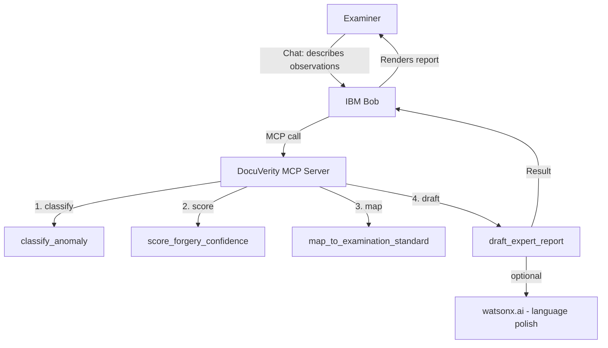

# Architecture

## System Architecture

## Components

| Component | Technology | Responsibility |
|---|---|---|
| Conversational front-end | IBM Bob | Collects examiner input, orchestrates MCP tool calls, presents results conversationally |
| MCP server | Python (MCP SDK) | Hosts the 4 examination tools, exposes them to Bob over MCP |
| Anomaly classifier | Rule-based Python module | Maps flagged indicators to an anomaly category |
| Confidence scorer | Rule-based Python module | Produces a weighted 0-100 forgery confidence score with a breakdown |
| Standards mapper | Static lookup table | Links anomaly categories to relevant examination standard references |
| Report drafter | Python + optional watsonx.ai call | Compiles findings into a structured expert opinion report |

## Data Flow

1. The examiner describes what they observed to Bob in natural language.
2. Bob (or a thin normalization step) converts this into a structured observation record: which of the 5 indicator categories are flagged, and at what severity.
3. The observation record is passed to `classify_anomaly`, which returns an anomaly category.
4. The same record is passed to `score_forgery_confidence`, which returns a 0-100 score and a per-indicator breakdown.
5. The anomaly category is passed to `map_to_examination_standard`, which returns the relevant standard references.
6. All of the above are passed to `draft_expert_report`, which renders a structured Markdown report — optionally polishing the prose via watsonx.ai if an API key is configured.
7. Bob returns the finished report to the examiner for review.

## Security Considerations

- No real case data is required for the demo — all sample inputs are mock/synthetic.
- API keys (watsonx.ai) are read from environment variables via `.env`, which is git-ignored and never committed.
- The MCP server does not persist any examiner input or generated report to disk by default.

## Scalability Notes

The MCP server is stateless per call, so it could be horizontally scaled behind a process manager if examination volume grew. The rule-based classifier and scorer are the parts most likely to evolve — swapping in a trained model later would only require changing the internals of `classify_anomaly` and `score_forgery_confidence`, since the MCP tool interface (inputs/outputs) would stay the same.
